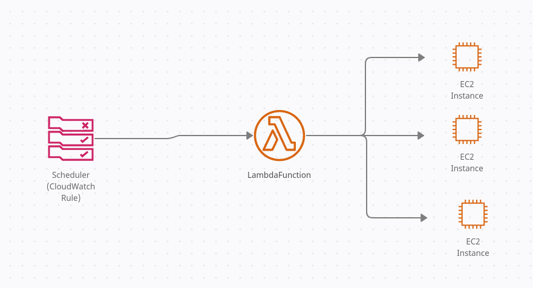

## Disable EC2 Instances ##
In order to stay within the free tier of new  developement/test accounts this project will shutdown EC2 Instances overnight.

You can specify a tag name in the lambda env variables that the lambda require before shutting down.  (If you leave it blank, it will shutdown all running instances in the current region.)

template-mvn.yml creates a scheduled event via (CloudWatch Rules) and a Lambda function that will shutdown any running EC2 instances overnight.  
via a SAM-based CloudFormation template.

The Rule is scheduled to call a lambda function every night at 3AM EST to check for any running EC2 instances.

`template-mvn.yml:`
````json
  ScheduledRule:
    Type: AWS::Events::Rule
    Properties: 
      Description: To fire off the disable-running-resources lambda function
      Name: disable-running-resources-lambda-schedule
      ScheduleExpression: cron(0 8 * * ? *)
````

Change CloudWatchRuleScheduleExpression to below for testing:

Parameters:
  CloudWatchRuleScheduleExpression:
    Type: String
    Default: "cron(0 8 * * ? *)"

NOTE: Currently there's an override in 3-deploy.sh:

    ````
    aws cloudformation deploy --template-file out.yml --stack-name disable-running-resources --parameter-overrides CloudWatchRuleScheduleExpression="rate(5 minutes)" --capabilities CAPABILITY_NAMED_IAM 
    ````


The lambda function will only stop instances with a tag name you enter under the Lambda Environment Variable STOP_EC2_INSTANCES_WITH_TAG_NAME.  If you leave this blank, it will stop all running instances.  

This project is based on AWS's [basic java sample application](https://github.com/awsdocs/aws-lambda-developer-guide/tree/master/sample-apps/blank-java).


### To Deploy the Project ###
- run the below on command line:
````bash
./1-create-bucket.sh  
./2-build-layer.sh  
./3-deploy.sh  
./4-invoke.sh	
./5-cleanup.sh
````

````bash
# to save some terminal space, run:
./2-build-layer.sh | tail && ./3-deploy.sh

### Misc ###
````bash
# start an instance
aws ec2 start-instances --instance-ids {instance id(s)}

# display status of instances
aws ec2 describe-instances --query "Reservations[*].Instances[*].{Instance:InstanceId,AZ:Placement.AvailabilityZone,Name:Tags[?Key=='Name']|[0].Value,State:State.Name,Reason:StateTransitionReason}" --output table

# in another window 'tail' cloudwatch:
aws logs tail --since 5m --follow {log group name}


### To Do ###
- add SNS notification when shutting down instances
    - add parameter to lambda function
- update unit tests
- place in code commit
- remove phone number & email address from template-mvn.yml and out.yml (if tracking)
- clean up logging
    - can you suppress x-ray logging?


### In Progress ###

### Done ###
- refactor java
- make rule/schedule a parameter and override it in cf cli command
- remove out.yml from git
- is CloudWatchRuleScheduleExpression getting configured correctly?
    - is it set up correctly in cf template?
- remove calls to account name, etc in lambda
- troubleshoot text messaging (not receiving)


# Disable Running Resources



The project source includes function code and supporting resources:

- `src/main` - A Java function.
- `src/test` - A unit test and helper classes.
- `template-mvn.yml` - An AWS CloudFormation template that creates an application.
- `pom.xml` - A Maven build file.
- `1-create-bucket.sh`, `2-build-layer.sh`, etc. - Shell scripts that use the AWS CLI to deploy and manage the application.

Use the following instructions to deploy the sample application.

# Requirements
- [Java 8 runtime environment (SE JRE)](https://www.oracle.com/java/technologies/javase-downloads.html)
- [Gradle 5](https://gradle.org/releases/) or [Maven 3](https://maven.apache.org/docs/history.html)
- The Bash shell. For Linux and macOS, this is included by default. In Windows 10, you can install the [Windows Subsystem for Linux](https://docs.microsoft.com/en-us/windows/wsl/install-win10) to get a Windows-integrated version of Ubuntu and Bash.
- [The AWS CLI](https://docs.aws.amazon.com/cli/latest/userguide/cli-chap-install.html) v1.17 or newer.

If you use the AWS CLI v2, add the following to your [configuration file](https://docs.aws.amazon.com/cli/latest/userguide/cli-configure-files.html) (`~/.aws/config`):

```
cli_binary_format=raw-in-base64-out
```

This setting enables the AWS CLI v2 to load JSON events from a file, matching the v1 behavior.

# Setup
Download or clone this repository.

    $ git clone https://github.com/awsdocs/aws-lambda-developer-guide.git
    $ cd aws-lambda-developer-guide/sample-apps/blank-java

To create a new bucket for deployment artifacts, run `1-create-bucket.sh`.

    blank-java$ ./1-create-bucket.sh
    make_bucket: lambda-artifacts-a5e491dbb5b22e0d

To build a Lambda layer that contains the function's runtime dependencies, run `2-build-layer.sh`. Packaging dependencies in a layer reduces the size of the deployment package that you upload when you modify your code.

    blank-java$ ./2-build-layer.sh

# Deploy

To deploy the application, run `3-deploy.sh`.

    blank-java$ ./3-deploy.sh
    BUILD SUCCESSFUL in 1s
    Successfully packaged artifacts and wrote output template to file out.yml.
    Waiting for changeset to be created..
    Successfully created/updated stack - blank-java

This script uses AWS CloudFormation to deploy the Lambda functions and an IAM role. If the AWS CloudFormation stack that contains the resources already exists, the script updates it with any changes to the template or function code.

You can also build the application with Maven. To use maven, add `mvn` to the command.

    java-basic$ ./3-deploy.sh mvn
    [INFO] Scanning for projects...
    [INFO] -----------------------< com.example:blank-java >-----------------------
    [INFO] Building blank-java-function 1.0-SNAPSHOT
    [INFO] --------------------------------[ jar ]---------------------------------
    ...

# Test
To invoke the function, run `4-invoke.sh`.

    blank-java$ ./4-invoke.sh
    {
        "StatusCode": 200,
        "ExecutedVersion": "$LATEST"
    }

Let the script invoke the function a few times and then press `CRTL+C` to exit.

The application uses AWS X-Ray to trace requests. Open the [X-Ray console](https://console.aws.amazon.com/xray/home#/service-map) to view the service map.


Choose a node in the main function graph. Then choose **View traces** to see a list of traces. Choose any trace to view a timeline that breaks down the work done by the function.


Finally, view the application in the Lambda console.

*To view the application*
1. Open the [applications page](https://console.aws.amazon.com/lambda/home#/applications) in the Lambda console.
2. Choose **blank-java**.

  

# Cleanup
To delete the application, run `5-cleanup.sh`.

    blank$ ./5-cleanup.sh
